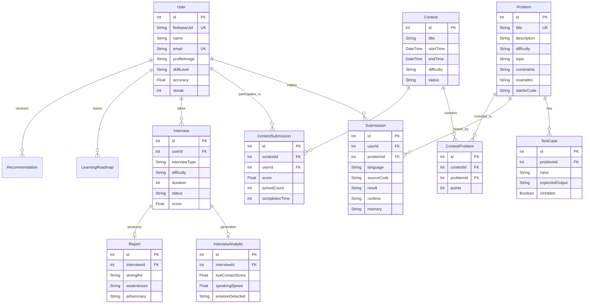

# SkillConnect AI Database Schema Details

This document breaks down the complete PostgreSQL database architecture for SkillConnect AI. The schema is highly relational, ensuring data integrity across users, coding problems, contests, and AI interview analytics.

## Entity-Relationship (ER) Diagram

---

## Detailed Model Breakdown

### 1. Core Models
*   **`users`**: The central hub. Links to Firebase Authentication via `firebase_uid`. It caches high-level stats like `accuracy` and `streak` to prevent expensive aggregations on the dashboard.
*   **`problems`**: The core challenge library. It stores the problem description, constraints, and `starter_code`.

### 2. Evaluation Engine
*   **`test_cases`**: Linked to `problems` (1-to-Many). Contains the `input` and `expected_output`. The `is_hidden` flag ensures users cannot hardcode solutions for hidden test cases.
*   **`submissions`**: The junction table between `users` and `problems` (Many-to-Many). Every time a user submits code via Judge0, a record is created here tracking the `language`, `source_code`, `result` (e.g., "Accepted", "Wrong Answer"), and execution metrics (`runtime`, `memory`).

### 3. Contest System
*   **`contests`**: Defines the active event, with a strict `start_time` and `end_time`.
*   **`contest_problems`**: A junction table linking a `contest` to specific `problems`. This allows the same problem to be reused across multiple contests, and assigns a specific `points` value for that context.
*   **`contest_submissions`**: Tracks a user's progress within a specific contest. It aggregates their `score` and `completionTime`.

### 4. AI Mentorship & Interview System
*   **`interviews`**: Tracks a live AI interview session.
*   **`interview_analytics`**: A 1-to-1 relation with `interviews`. It stores the granular telemetry extracted by the AI (eye contact, speaking speed, nervousness).
*   **`reports`**: A 1-to-1 relation with `interviews`. Represents the final generated summary given to the user after the interview concludes.

### 5. Progression System
*   **`learning_roadmaps`**: Tracks the user's progress through specific tech stacks or algorithm topics.
*   **`recommendations`**: AI-generated prompts suggesting which problem the user should tackle next based on their recent submission failures.
